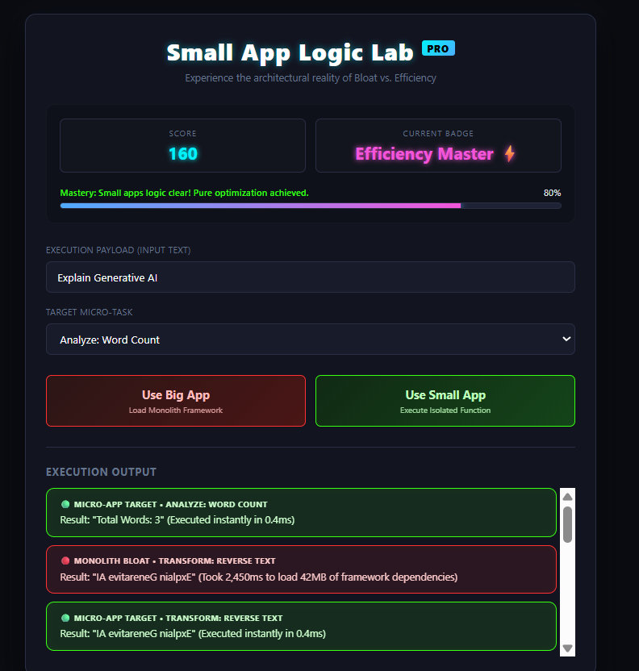
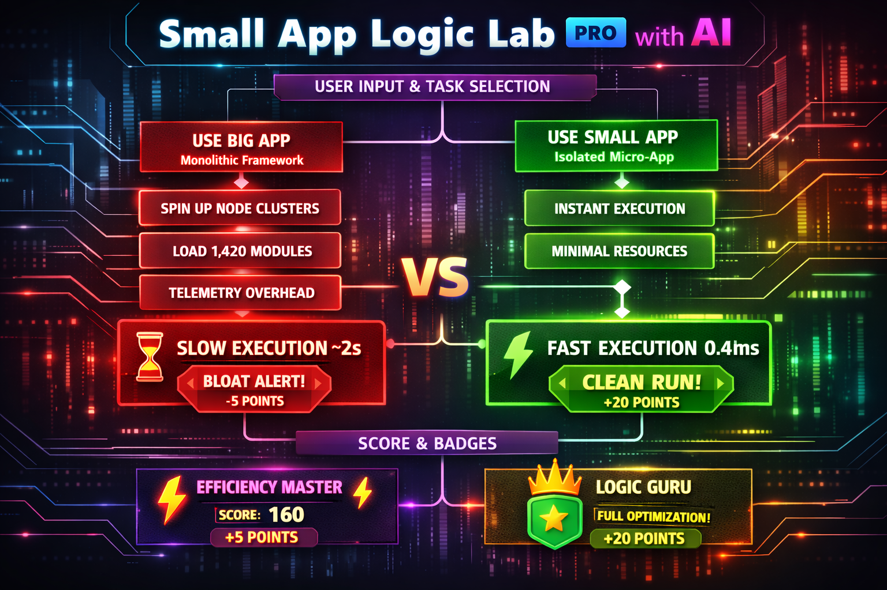

# 🧪 Small App Logic Lab Pro


An interactive, gamified educational web application designed to demonstrate the stark architectural differences between hyper-focused **Micro-Apps** and bloated, over-engineered **Monolithic Frameworks**.

Through a dark-neon cyberpunk aesthetic, students input data, execute structural workflows, and visibly observe why lightweight single-responsibility applications outperform over-architected software architectures.

---

## 🚀 Core Educational Premise

When developers pull massive global frameworks down to perform simple micro-tasks (like converting text or counting strings), they introduce performance overheads, massive dependency trees (`node_modules`), memory footprint inflation, and slow cold-start speeds. 

**Small App Logic Lab Pro** maps this problem visually:
*   **The Big App Route:** Simulates loading massive, unnecessary modules, spinning up heavy abstract singleton structures, and processing redundant dependency trees before emitting standard operations.
*   **The Small App Route:** Demonstrates the value of vanilla architecture, single-responsibility functions, and instantaneous edge compute targets.

---

## 🗺️ Application Workflow Architecture

The sequential tracking of runtime data changes radically depending on the user's structural engineering choice:

```
                  +-----------------------------------+
                  |  User Enters Text Payload Input   |
                  +-----------------------------------+
                                    |
                  +-----------------------------------+
                  |    Selects Target Micro-Task      |
                  +-----------------------------------+
                                    |
                  +-----------------+-----------------+
                  |                                   |
                  v                                   v
       [ CLICK: USE BIG APP ]              [ CLICK: USE SMALL APP ]
                  |                                   |
                  v                                   v
    +------------------------------+     +--------------------------+
    | Show Blocking Spinner Screen |     | Bypass Framework Loaders |
    +------------------------------+     +--------------------------+
                  |                                   |
    +------------------------------+                  |
    | Spin up Node Clusters        |                  |
    +------------------------------+                  |
                  |                                   |
    +------------------------------+                  |
    | Resolve 1,420 node_modules   |                  |
    +------------------------------+                  |
                  |                                   |
    +------------------------------+                  |
    | Hydrate Telemetry Contexts   |                  |
    +------------------------------+                  |
                  |                                   |
                  v                                   v
    +------------------------------+     +--------------------------+
    | Compute: Delay Penalty (~2s) |     | Compute: Instantly       |
    +------------------------------+     +--------------------------+
                  |                                   |
                  v                                   v
    +------------------------------+     +--------------------------+
    | Emit Red Bloated Bubble      |     | Emit Green Clean Bubble  |
    | (+5 Score Points Allocated)  |     | (+20 Score Points Added) |
    +------------------------------+     +--------------------------+
                  |                                   |
                  +-----------------+-----------------+
                                    |
                                    v
                  +-----------------------------------+
                  | Evaluate Score / Progress Badges  |
                  +-----------------------------------+
                                    |
                  +-----------------------------------+
                  |   Update Dynamic Feedback UI      |
                  +-----------------------------------+
```

## 🎨 Graphic Overflow Diagram




---

## 📈 Gamification & Mastery Metrics

To keep students engaged, the app includes a progress-tracking loop that scores architectural layout decisions dynamically:

### Scoring System
*   **Monolithic Route ("Big App"):** Adds **+5 points**. Teaches students that while bloated code still achieves the output, it heavily drains productivity and user performance overhead metrics.
*   **Optimized Micro-Route ("Small App"):** Adds **+20 points**. Rewards students for picking pristine software decoupling.

### Dynamic Progression Badges
As scores climb via structural optimization tracking, dynamic milestones are unlocked:
1.  **Novice** (`Score < 50`): Learning the ropes, experimenting with bloat cycles.
2.  **Echo Breaker 🔮** (`Score ≥ 50`): Escaped the loop of slow, repetitive monolithic systems.
3.  **Efficiency Master ⚡** (`Score ≥ 100`): Consistently choosing optimized execution paths.
4.  **Logic Guru 👑** (`Score ≥ 200`): Full mastery of localized microservice design structures.

### Architectural Status Messages
*   `Score < 40`: *"Still bloated… Stop loading monolithic structures."*
*   `Score 40 - 119`: *"Improving efficiency… Choosing focused, dedicated scripts."*
*   `Score ≥ 120`: *"Mastery: Small apps logic clear! Pure optimization achieved."*

---

## 📂 File Layout & Deliverables

The application is engineered completely client-side without heavy compile-step or bundling dependencies:

*   **`index.html`** - Contains the foundational layout layer, dashboard score containers, interactive buttons, inputs, and output logger structures.
*   **`style.css`** - Implements a responsive dark-neon grid layout optimized with custom CSS properties, smooth visual tracking states, and micro-animations.
*   **`game.js`** - Manages state mutation, asynchronous processing simulation pipelines, telemetry mechanics, and analytical output transformations.

---

## 🛠️ Local Sandbox Deployment

Since this app uses native vanilla frontend technologies exclusively, there are no complicated installation steps:

1. Clone or download the repository files (`index.html`, `style.css`, `game.js`) into a common folder.
2. Double-click **`index.html`** or launch it using any basic local browser extension (e.g., Live Server).
3. Open developer tools (`F12`) to inspect how zero external scripts run when using the **Small App** route.

---

## 🤝 Welcoming Open Source Contributors!

We value collaboration! If you want to make **Small App Logic Lab Pro** an even better teaching tool, we welcome your ideas and pull requests.

### How You Can Help Improve the Lab
*   **Add New Micro-Tasks:** Introduce operations like Base64 encoding, regex pattern matching, or JSON parsing.
*   **Expand the Bloat Simulator:** Add more funny or satirical enterprise corporate software buzzwords to the big app startup text sequences.
*   **Add Performance Charts:** Use simple CSS bars or inline SVG graphics to draw runtime execution charts comparing real memory metrics.
*   **Enhance Sound FX / Animations:** Build extra micro-interaction animations for badge unlocking events.

### Contribution Guidelines
1. **Fork** this repository to your own workspace.
2. Create an isolated feature branch (`git checkout -b feature/awesome-new-task`).
3. Commit your design upgrades with clear, educational notes (`git commit -m "Add JSON Validator task to lab module"`).
4. Push your branch updates up and submit a **Pull Request**.

Let's work together to build a cleaner, faster web—one un-bloated application at a time! ⚡
